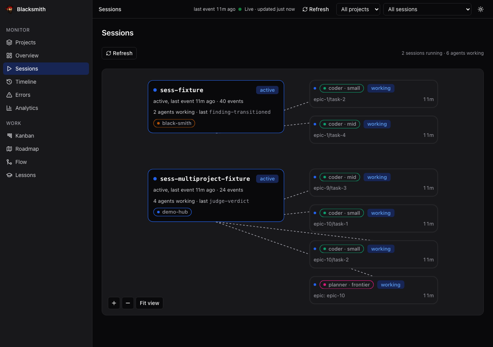
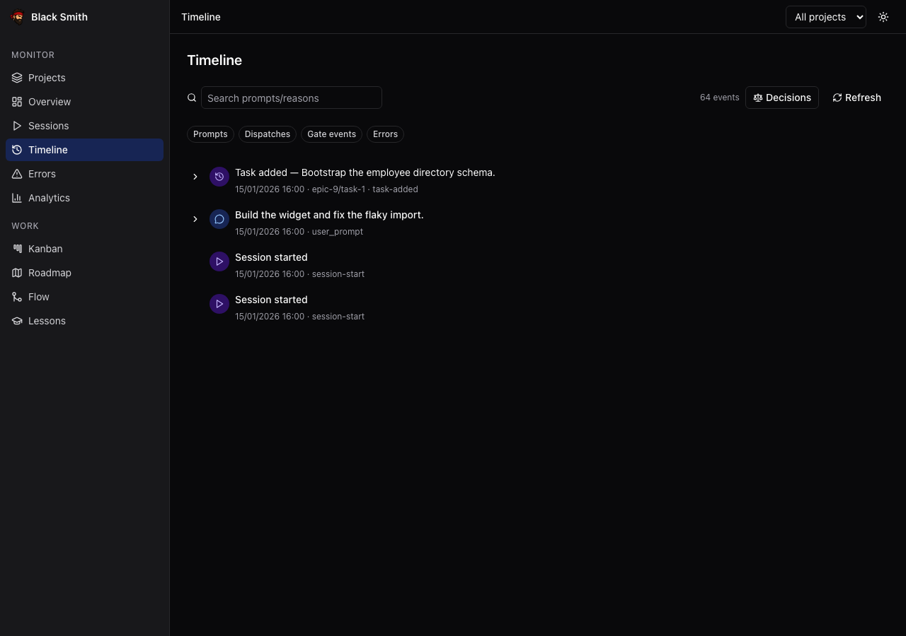

<div align="center">


# Blacksmith

**An autonomous agent factory.**

You co-plan the spec. It decomposes, codes, tests, reviews, refutes itself —<br />
and hands you exactly one pull request.

[](https://github.com/juzser/blacksmith/actions/workflows/ci.yml)


**[Features](#features) · [Install](#install) · [Using it](#using-it) ·
[How it works](#how-it-works) · [Safety](#safety) · [Status](#status) ·
[Docs](#docs)**


<sub>The one screen that asks something of you. The rest is the factory reporting in.</sub>

</div>

## Why Blacksmith

Handing a whole feature to an agent tends to fail in the same place, and it is
rarely the code. Two workers edit the same file. One quietly renegotiates the
goal it was given. A third reports itself done, and you find out in review. The
usual remedy is to watch it work — which costs exactly what the automation was
supposed to buy.

Blacksmith removes the watching instead. A goal becomes a set of immutable spec
contracts. Each contract runs in its own git worktree, under a token budget,
over paths no other worker is allowed to touch. What merges is decided by gates
— a schema check, tests, a reviewer that never saw the coder's session, and a
verifier whose only job is to refute the reviewer.

Your job shrinks to two touchpoints: **agree on the spec**, then **review one
pull request**. Everything in between runs unattended.

## Features

<table>
<tr valign="top">
<td width="50%">

**Nothing is dispatched without a contract**

Every task carries an objective, an output schema, acceptance criteria, a tool
allowlist, the exact paths it may touch and a token budget. The plan is frozen
the moment you sign it and versioned in the event log, so a worker cannot
quietly reinterpret the job. No contract, no dispatch.

</td>
<td width="50%"></td>
</tr>

<tr valign="top">
<td></td>
<td>

**Workers that cannot collide**

Path claims come from static analysis, not from epic prose. A wave is admitted
only once its tasks' claims are pairwise disjoint, which is what lets a whole
column run at the same time in separate worktrees; overlapping work serializes
instead. An edit outside a claim fails the gate rather than reaching the queue.

</td>
</tr>

<tr valign="top">
<td>

**A frontier planner, cheap workers**

Planning and judgment go to a frontier model; the bulk of the work goes to
small, fast tiers, many at once. Every session and every live agent is visible
with the tier that drew it, and analytics breaks cost down per task, per tier
and per provider.

</td>
<td></td>
</tr>

<tr valign="top">
<td></td>
<td>

**Gates decide what merges, not confidence**

Schema check → tests → coverage evidence → a fresh-context reviewer that never
sees the coder's session → an adversarial verifier whose only job is to refute
the reviewer. S1 stops the line, S2 bounces back to the same branch, S3 batches
into one waiver question per epic. Only S3 and S4 are ever waivable.

</td>
</tr>

<tr valign="top">
<td>

**A second opinion from another vendor**

The factory grades its own judgment calls against models from a different
vendor — Codex over its CLI, DeepSeek over its API, beside the native Claude
judge. They ship enabled but in **shadow mode**: every verdict is recorded,
none of them gates anything, until you have read the numbers and promoted one
deliberately.

</td>
<td></td>
</tr>

<tr valign="top">
<td></td>
<td>

**It learns from its own errors**

Errors are classified against a taxonomy, and a scribe distills them into
lesson candidates you approve or reject. Approved lessons splice into later
prompts — and the same-mistake rate on the analytics page tells you whether
that is actually working. A loop you can audit, not a memory you have to trust.

</td>
</tr>

<tr valign="top">
<td>

**The log is the source of truth**

Every prompt, dispatch, gate result and error is an append-only event on disk.
The dashboard is a projection of that log, and `smith db rebuild` reconstructs
the entire database from the log alone. Nothing the factory did exists only in
a chat transcript.

</td>
<td></td>
</tr>
</table>

**Also in the box**

- **Eleven dashboard pages**, dark and light, desktop and mobile: errors by
  taxonomy category, roadmap progress joined to real task and token counts, and
  per-project scoping. It binds to `127.0.0.1` and is read-only — clicking
  nothing there dispatches an agent.
- **Project scaffolding.** `/bs new <project>` generates a target project from
  the stack you answered for at install time; `/bs mcp` layers an MCP surface
  onto it.
- **A factory that extends itself.** New agent roles, policies and taxonomy
  values are data files, not code — see
  [extending](docs/guide/extending.md).
- **One integration branch per epic**, one pull request at the end, merged by
  you.

## Install

```bash
git clone https://github.com/juzser/blacksmith.git && cd blacksmith
pnpm install --frozen-lockfile
pnpm run build                          # tsc -> factory/orchestrator/dist/
node factory/orchestrator/dist/cli.js --help
```

Verify it with the same gate CI runs (this one also needs `python3` + PyYAML):

```bash
bash scripts/check.sh                   # ends in `== PASS ==` on a good install
```

Driving a real epic additionally needs the **Claude Code CLI** — the planner and
every worker run as Claude Code sessions.

**Rather not do this by hand?** Open a Claude Code session in the clone and say
*"install Blacksmith"*. [`INSTALL.md`](INSTALL.md) is an executable runbook: it
asks before touching anything outside the clone, and it doubles as the human
version — per-platform setup (macOS, Debian/Ubuntu, Fedora, Alpine, WSL2),
troubleshooting, and the known platform gaps stated rather than papered over.

## Using it

Day to day, from a Claude Code session opened in this repo:

| Command | What it does |
|---|---|
| `/bs new <project> [--ui]` | Scaffold a new target project from your stack answers |
| `/bs mcp <project>` | Layer the MCP surface on and make its milestone due |
| `/bs plan <goal>` | Draft or re-plan an epic with the planner + spec-reviewer |
| `/bs run <epic>` | Admit a wave and drive it through the loop to merge |
| `/bs status` | Live agent count, budget burn, epic phase |
| `/bs ui` | Serve the local dashboard |
| `/bs waivers` | Answer the pending S3/S4 waiver batch for an epic |
| `/bs lessons` | Review pending lesson candidates |
| `/bs report` | Render the scribe's progress digest |

Underneath, every one of those is a `smith` command you can run yourself —
`smith --help` lists them all.

→ **[The operator loop](docs/guide/operator-loop.md)** — the six steps, in the
order you meet them.<br />
→ **[Operator guide](docs/guide/operator-guide.md)** — the same ground with real
commands and real output.<br />
→ **[The dashboard](docs/guide/dashboard.md)** — what each of the eleven pages
shows you.

## How it works

You describe a goal. A planner on a frontier model turns it into spec contracts
and a spec-reviewer hunts holes in them *before* you sign; signing freezes plan
v1. From there the loop admits a wave whose path claims do not overlap, sends
researcher and UI/UX work ahead of code where the epic needs it, runs a coder
and a tester in a worktree, grades the result against its own acceptance
criteria, then puts it through the gates and a serial merge queue into
`smith/<epic>/integration`. One epic, one integration PR, merged by you.

→ The pipeline diagram and the reasoning behind each stage:
**[architecture §3 — The loop](docs/specs/black-smith-architecture.md#3-the-loop)**.

## Safety

Enforced mechanically — a `PreToolUse` policy layer on every command an agent
runs, plus branch protection — not by trust. Full rules:
**[`docs/standards/guardrails.md`](docs/standards/guardrails.md)**.

- **Secrets are environment-only.** `.env.example` is the only committed env
  file (variable names, never values), and the event logger redacts
  credential-shaped strings before write.
- **Only you merge to `main`.** No agent may push, force-push or merge to a
  protected branch; task branches reach the integration branch solely through
  the serial merge queue.
- **No autonomous deploy or outbound sends.** Deploys, publishes and message
  sends each need per-invocation approval.
- **Budgets are declared per role.** 4M tokens per epic with an alarm at 70%;
  150K tokens and 400 diff lines per coder task. Fan-out is bounded by the
  claim graph, and `max_in_flight_tasks` is available on top of it, off by
  default. Which of these *block* versus *report* is spelled out in
  [`factory/policies/budgets.yml`](factory/policies/budgets.yml) — the task cap
  reports on purpose.

Found a vulnerability? [`SECURITY.md`](SECURITY.md) — report privately, not in
a public issue.

## Status

Phases 1–9 are built and merged: loop runner, worktree engine, gates, state and
analytics, dashboard, self-extension, cross-provider judges, hardening. Phase 10
is half in: `smith daemon` watches the factory in the background and its ops
runbook is written; the hosted UI stays deferred.

The one thing to know up front: **the daemon watches, it does not drive.** It
tells you what the factory needs — budget alarms, agents that never came back,
rechecks and cadences that are due — without an open session. Doing the work is
still `/bs run`, a playbook your Claude Code session follows; close the session
and nothing advances.

→ **[What is built, what is not](docs/guide/status.md)**, and the unflinching
version in
[Limitations today](docs/guide/operator-guide.md#limitations-today).

## Docs

| Doc | For |
|---|---|
| [`INSTALL.md`](INSTALL.md) | Getting it running, per platform |
| [`docs/guide/operator-loop.md`](docs/guide/operator-loop.md) | The six steps you actually do |
| [`docs/guide/operator-guide.md`](docs/guide/operator-guide.md) | Every command, end to end, with output |
| [`docs/guide/dashboard.md`](docs/guide/dashboard.md) | The dashboard tour |
| [`docs/guide/status.md`](docs/guide/status.md) | What is real today |
| [`docs/guide/extending.md`](docs/guide/extending.md) | Adding agents, policies, taxonomy values |
| [`docs/specs/black-smith-architecture.md`](docs/specs/black-smith-architecture.md) | Why it is shaped this way |
| [`docs/runbooks/providers.md`](docs/runbooks/providers.md) | Setting up the cross-provider judges |
| [`docs/runbooks/ops.md`](docs/runbooks/ops.md) | Running `smith daemon` unattended |
| [`docs/README.md`](docs/README.md) | Everything else, one line each |

Agents read [`AGENTS.md`](AGENTS.md) and [`CLAUDE.md`](CLAUDE.md) instead — this
repo is self-governing, and the rules it runs under live there.

## Contributing

[`CONTRIBUTING.md`](CONTRIBUTING.md) has the details. Two things up front: the
gate is `bash scripts/check.sh` and it is the same script CI runs, so red
locally is red there; and several artifacts here are *generated* — see
[extending](docs/guide/extending.md) for which files you may hand-edit.

[`CODE_OF_CONDUCT.md`](CODE_OF_CONDUCT.md) ·
[`SECURITY.md`](SECURITY.md) ·
[`CHANGELOG.md`](CHANGELOG.md)

## License

[MIT](LICENSE)
