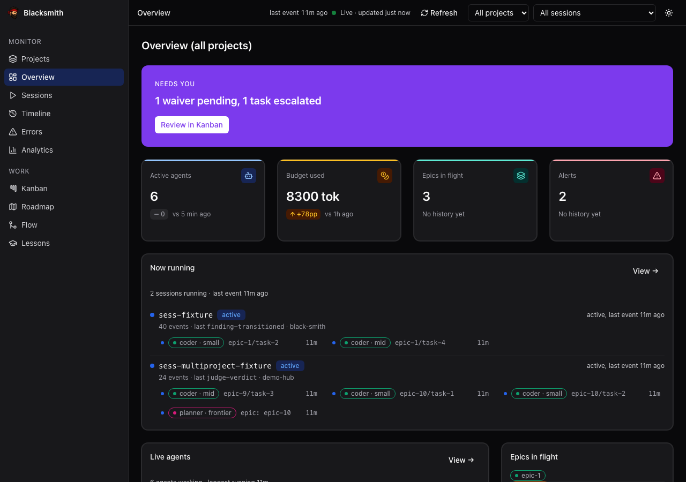
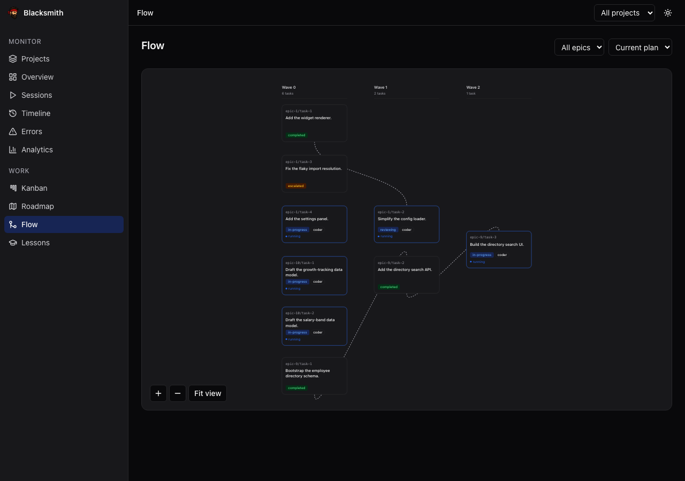
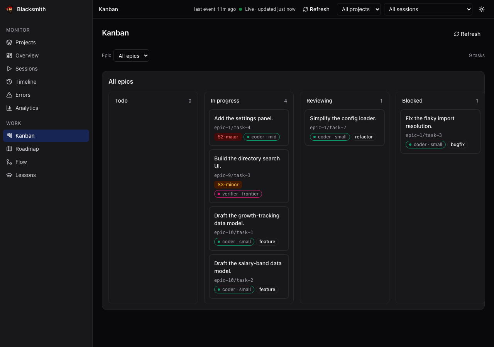
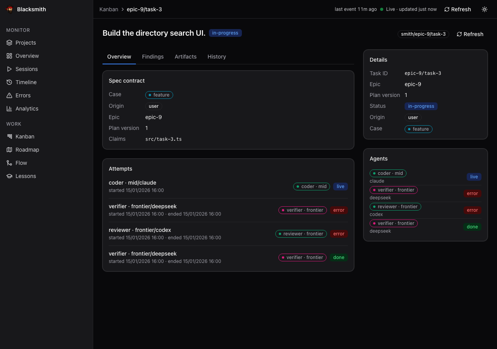
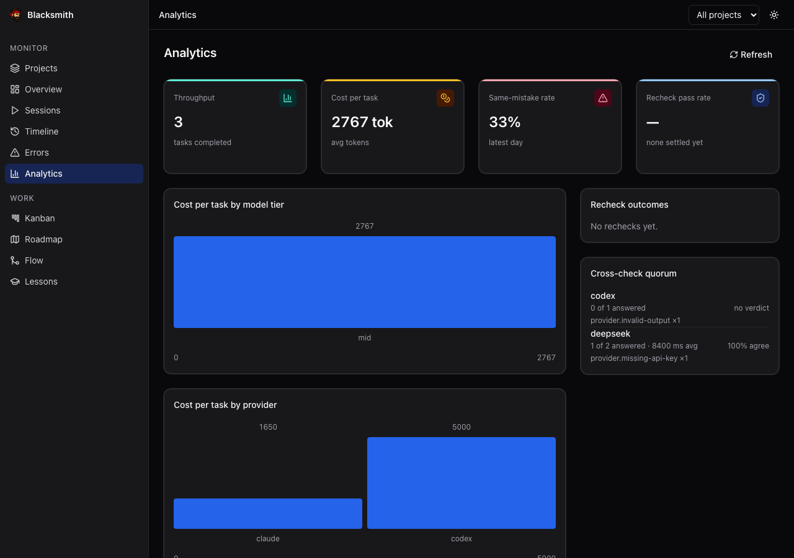
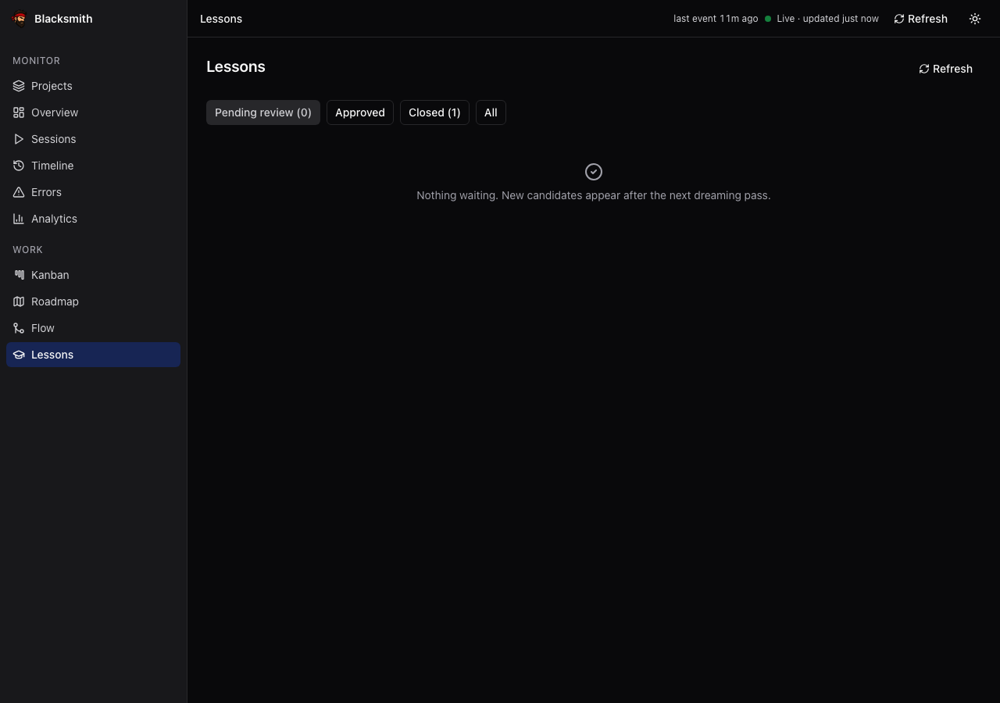

# The dashboard

A local, read-only view of what the factory is doing. Nothing you click here
dispatches an agent — the dashboard is a *projection* of the append-only event
log, and `smith db rebuild` reconstructs the whole thing from that log alone.

```bash
pnpm build:server && pnpm build:ui   # -> ui/server/dist + ui/dist
smith ui serve                       # http://127.0.0.1:4680
```

From a Claude Code session, `/bs ui` does the same and prints the URL.

It binds to `127.0.0.1` and ships no auth, because it is a local tool showing
you your own event log. Do not put it on a public interface.

## The pages

<table>
<tr>
<td width="50%"></td>
<td width="50%"></td>
</tr>
<tr valign="top">
<td><b>Overview</b> — the one screen that asks something of you. The
<code>Needs you</code> banner counts pending waivers and escalated tasks;
under it, live agent count, budget burn, epics in flight, and what is running
right now. Everything else is the factory reporting in.</td>
<td><b>Flow</b> — the plan as waves. Waves are layers of the dependency graph;
a wave is only admitted once its tasks' path claims are pairwise disjoint,
which is what lets everything in a column run at the same time.</td>
</tr>
<tr>
<td></td>
<td></td>
</tr>
<tr valign="top">
<td><b>Kanban</b> — where every task sits, what severity it carries, and which
model tier drew it. <code>Blocked</code> and <code>Reviewing</code> are the two
columns that can end up waiting on you.</td>
<td><b>Task detail</b> — the contract a worker was actually handed: its case,
its plan version, and the exact paths it was allowed to touch. Under it, every
attempt, with the provider that ran it and how it ended.</td>
</tr>
<tr>
<td></td>
<td></td>
</tr>
<tr valign="top">
<td><b>Analytics</b> — cost per task by tier and by provider, plus the
same-mistake rate: the number that says whether the lessons loop is teaching
it anything. The cross-check quorum panel shows how the external judges are
voting while they are in shadow mode.</td>
<td><b>Lessons</b> — the candidates the scribe distilled from errors and
decision checkpoints, waiting on an approve or a reject. This is the surface
for step 6 of <a href="operator-loop.md">the operator loop</a>.</td>
</tr>
</table>

Five more pages carry the rest:

| Page | What it is for |
|---|---|
| **Projects** (`/projects`) | The default route. Every project the factory knows about; picking one scopes the other pages to it. |
| **Sessions** (`/sessions`) | Every orchestrator session, including the cross-session parent edges that let one epic span several. |
| **Timeline** (`/timeline`) | The event log itself, grouped by dispatch — every prompt, dispatch, error and gate result, in order. |
| **Roadmap** (`/roadmap`) | Milestone progress, parsed from [`factory/specs/roadmap.md`](../../factory/specs/roadmap.md) and joined with real task and token counts. |
| **Errors** (`/errors`) | Errors by taxonomy category — the raw material the lessons loop distills from. |

## The screenshots are real

Everything above is a committed e2e fixture under
[`ui/e2e/__screenshots__/`](../../ui/e2e/__screenshots__), rendered and
diffed by `pnpm test:e2e` on every gate run. The data in them is synthetic;
the pixels are not a mockup. Every page is captured desktop and mobile
(390px), light and dark.

If a local gate run leaves those PNGs dirty in `git status`, that is the
specs rewriting their own artifacts — `scripts/check.sh` says so explicitly.
Commit them only if the branch meant to change the UI.

## Rebuilding it

The projection is disposable by design. `state/` is gitignored runtime
output, and everything in it can be reconstructed:

```bash
smith db rebuild        # drop the SQLite projection, replay the event log
```

If the dashboard and the log ever disagree, the log wins. That property is
the point of the architecture
([§7](../specs/black-smith-architecture.md)), not a convenience.

## Design

The dashboard follows a token-driven design system with mechanical gates —
no hardcoded colours, no emoji, contrast-checked in both themes. The spec is
[`ui/docs/design-spec.md`](../../ui/docs/design-spec.md) and the gates are
under [`scripts/design/`](../../scripts/design), wired into
`scripts/check.sh`.
