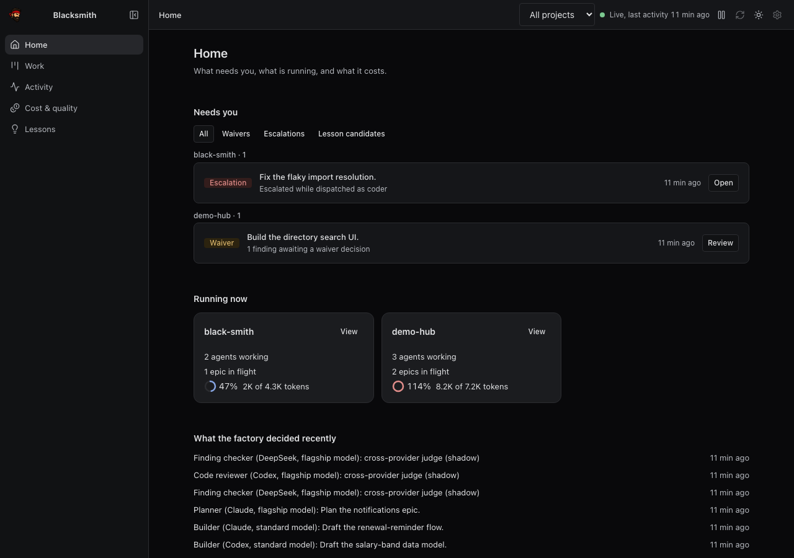
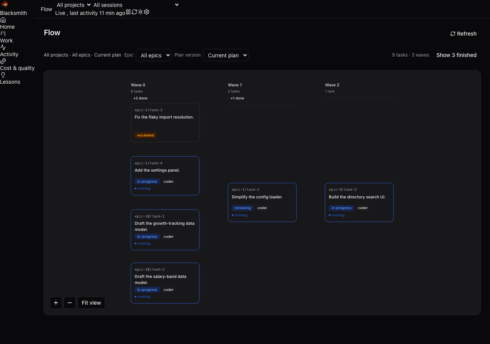
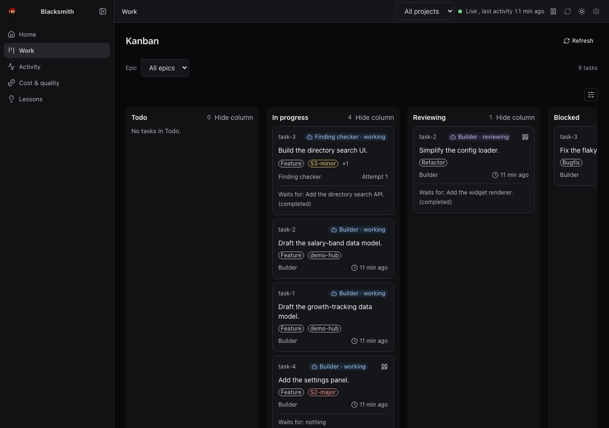
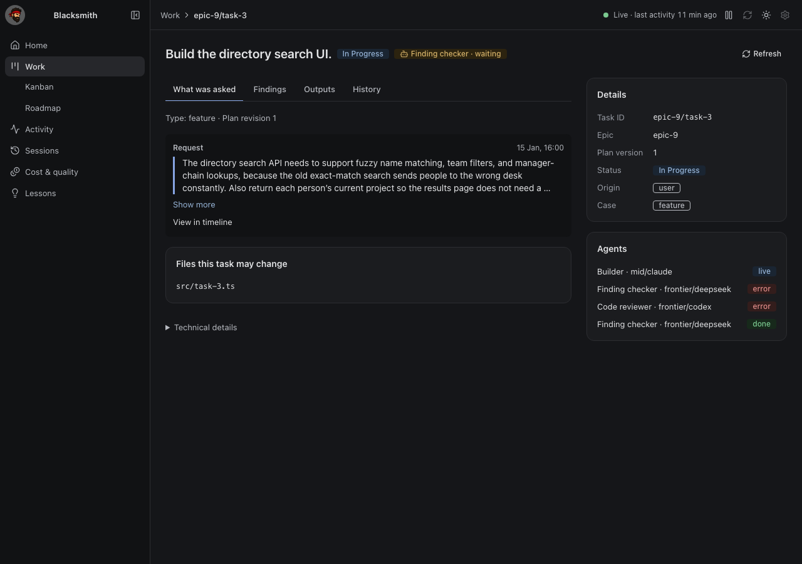
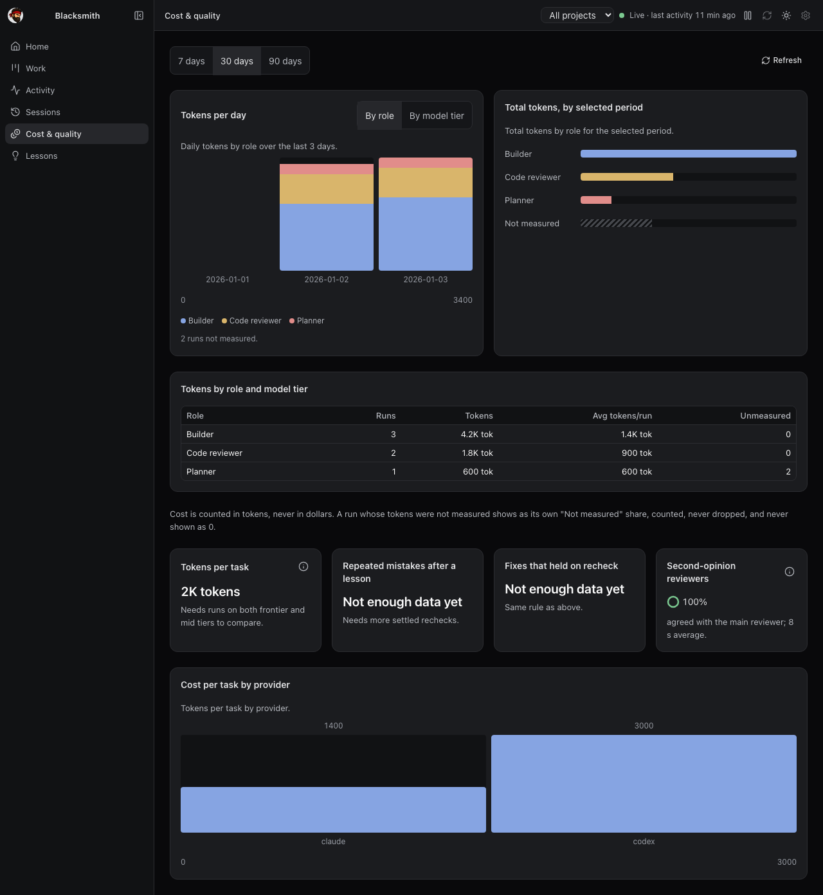
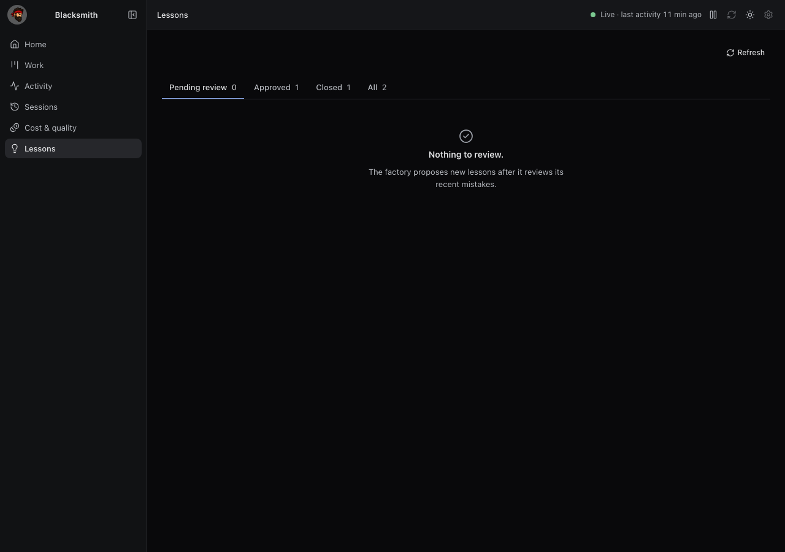

# The dashboard

A local, read-only view of what the factory is doing. Nothing you click here
dispatches an agent — the dashboard is a *projection* of the append-only event
log, and `bs db rebuild` reconstructs the whole thing from that log alone.

The server also reads, read-only, the local Claude Code session registry,
transcripts and prompt history — from `--claude-config-dir`, else `$CLAUDE_CONFIG_DIR`, else
Claude Code's default — and serves them as `GET /api/cli-sessions`, to
loopback requests only.

## Other projects' stores

Home and Kanban also show every project that has a live Claude Code CLI session,
not only the clone the dashboard was started in. For each live session's working
directory the server takes the git toplevel and treats it as a store when
`<top>/.blacksmith/state/events` (a `BS_HOME` layout) or `<top>/state/events` (a
clone) exists. Pass `--store <dir>` (repeatable) to add a state home that has no
live session. Discovery reruns at most every 5 seconds; stores are deduped by
realpath, so a session inside the served clone is the served store, not a second one.

A foreign store is only ever read. Its event logs are projected into a
dashboard-owned cache, `state/ui-stores/<storeId>.db` under the served clone;
nothing is created or written in the foreign project. A store that disappears is
dropped from the views and shows up as a `store-unavailable` issue on the pulse.
Rows from it carry `store: {id, label}` (the label is the project's directory
name). Only `/api/overview`, `/api/kanban` and `/api/projects` span stores for now.

**Project filter.** In a foreign store a row with no project, or with the factory
default, reads as the store's label; a row with any other explicit project reads as
that project. `?project=X` returns exactly the rows that read as X from every store,
each counted once, and a foreign store never answers `?project=<default>` with rows
that read as its label. The cache applies this after every fold; the foreign project
is not touched.

**Local-only.** Because those routes now carry other projects' data they answer
loopback requests only, like `/api/cli-sessions`, as does `/api/tasks/*`.

**Cache lifetime.** A store that drops out keeps its open cache for a grace period
(5 minutes), so a session that restarts is not folded again from scratch. An open task page of that store keeps loading, frozen at its last scan (the Kanban board shows live projects only). On
startup, cache files in `state/ui-stores/` whose store is not known and that were
last written more than 7 days ago are deleted; nothing outside that directory is
touched.

**Foreign tasks.** A foreign Kanban card opens its own task: the peek and the task
page read `GET /api/tasks/:taskId?store=<storeId>` (and `/runs`); an unknown store
is a 404, never the served store. The task page keeps the store in its URL
(`/tasks/<id>?store=<storeId>`), so a reload stays on it. History, artifacts and
waivers resolve in the served store only, so a foreign task shows their empty state
and offers no Waive or Deny.

```bash
pnpm build:server && pnpm build:ui   # -> ui/server/dist + ui/dist
bs ui serve                          # http://127.0.0.1:4680
```

From a Claude Code session, `/bs ui` does the same and prints the URL.

It binds to `127.0.0.1` and ships no auth, because it is a local tool showing
you your own event log. Do not put it on a public interface.

## Live sessions

Home lists one card per live, in-scope Claude Code CLI session, from
`GET /api/cli-sessions`. A session that drives a Blacksmith epic reads
`<project> · <epic> · wave N`, with a status tag, a **Now** line per working agent
(role and task title) and a **Next** line (the next task's title, or "Waiting on
you"). The title links to the epic on the Kanban board. A session linked to no epic
shows its working folder and name only.

The wave number comes from the newest session named `<epic>-w<N>-…` (a re-run,
`<epic>-w<N>r-…`, is still wave N) that is not older than the newest open wave; when
the epic has no such session it is 1 when the epic has a single admission, else the
title omits the wave. **Next** is the first open task of the current wave, in the
wave's order; a task with no name shows nothing rather than a later task. Each live session is matched against every discovered store, so a session
driving another project's own Blacksmith home shows its epic too; those homes are
only read, never written (a `?session` query still reads the served home alone).

## The pages

<table>
<tr>
<td width="50%"></td>
<td width="50%"></td>
</tr>
<tr valign="top">
<td><b>Home</b> (<code>/overview</code>, and where <code>/</code> lands) — the
one screen that asks something of you. The <code>Needs you</code> inbox lists
the waivers on finished work (completed tasks, or closed epics for epic-level
findings: the ones the factory will no longer act on), escalated tasks and
lesson candidates, grouped by project, each with one action; under it, what is running per project, what the factory
decided recently, and budget burn. Everything else is the factory reporting
in.</td>
<td><b>Flow</b> — the plan as waves. Waves are layers of the dependency graph;
a wave is only admitted once its tasks' path claims are pairwise disjoint,
which is what lets everything in a column run at the same time.</td>
</tr>
<tr>
<td></td>
<td></td>
</tr>
<tr valign="top">
<td><b>Kanban</b> — where every task sits, what severity it carries, and which
model tier drew it. <code>Blocked</code> and <code>Reviewing</code> are the two
columns that can end up waiting on you.</td>
<td><b>Task detail</b> — the contract a worker was actually handed: its case,
its plan version, and the exact paths it was allowed to touch. Under it, every
attempt, with the provider that ran it and how it ended.</td>
</tr>
<tr>
<td></td>
<td></td>
</tr>
<tr valign="top">
<td><b>Analytics</b> — cost per task by tier and by provider, plus the
same-mistake rate: the number that says whether the lessons loop is teaching
it anything. The cross-check quorum panel shows how the external judges are
voting while they are in shadow mode.</td>
<td><b>Lessons</b> — the candidates the scribe distilled from errors and
decision checkpoints, waiting on an approve or a reject. This is the surface
for step 6 of <a href="operator-loop.md">the operator loop</a>.</td>
</tr>
</table>

Four more pages carry the rest:

| Page | What it is for |
|---|---|
| **Sessions** (`/sessions`) | Every orchestrator session, including the cross-session parent edges that let one epic span several. |
| **Timeline** (`/timeline`) | The event log itself, grouped by dispatch — every prompt, dispatch, error and gate result, in order. |
| **Roadmap** (`/roadmap`) | Milestone progress, parsed from [`factory/specs/roadmap.md`](../../factory/specs/roadmap.md) and joined with real task and token counts. |
| **Errors** (`/errors`) | Errors by taxonomy category — the raw material the lessons loop distills from. |

## The screenshots are real

Everything above is a committed e2e fixture under
[`ui/e2e/__screenshots__/`](../../ui/e2e/__screenshots__), rendered and
diffed by `pnpm test:e2e` on every gate run. The data in them is synthetic;
the pixels are not a mockup. Every page is captured desktop and mobile
(390px), light and dark.

If a local gate run leaves those PNGs dirty in `git status`, that is the
specs rewriting their own artifacts — `scripts/check.sh` says so explicitly.
Commit them only if the branch meant to change the UI.

## Rebuilding it

The projection is disposable by design. `state/` is gitignored runtime
output, and everything in it can be reconstructed:

```bash
bs db rebuild           # drop the SQLite projection, replay the event log
```

If the dashboard and the log ever disagree, the log wins. That property is
the point of the architecture
([§7](../specs/black-smith-architecture.md)), not a convenience.

## Design

The dashboard follows a token-driven design system with mechanical gates —
no hardcoded colours, no emoji, contrast-checked in both themes. The spec is
[`ui/docs/design-spec.md`](../../ui/docs/design-spec.md) and the gates are
under [`scripts/design/`](../../scripts/design), wired into
`scripts/check.sh`.
